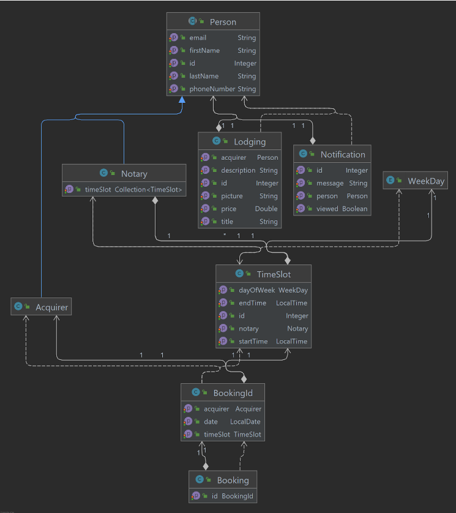
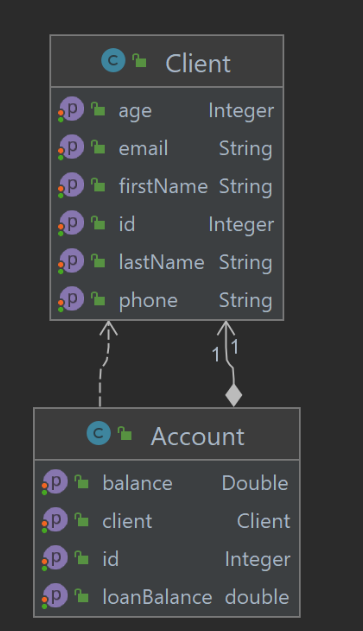

## Objectifs du système à modéliser
On se propose de modéliser un système de prise de rendez-vous (Notolib) entre des acquéreurs (Acquirer) et des notaires (Notary) afin de créer un appel de fond concernant le logement choisi. Le système Notolib gère ainsi les disponibilitées des notaires et la prise de RDV par l’acquéreur.

Notre système est composé de 3 services :
- Notolib : Service de rendez-vous entre Notaire et Acquéreur
- Fund_system : Système permettant la création de l'appel de fond
- Bank-transfer : Modélisation des banques respectives de l'acquéreur et du notaire

#Installation du projet

###Etape 1 :

Une fois le projet ouvert, ouvrez un terminal et placez-vous dans le répertoire notolib-ui, puis éxécuter les commandes suivantes :
```
npm install
npm start
```

Le projet va alors s'ouvrir dans un navigateur en localhost (par défaut ici : http://localhost:3000  )

###Etape 2 :

Dans les services vous devrez activer les 4 services quarkus qui sont les suivants :
* notolib
* fund_system
* bank-transfer (par défaut) qui sera la banque de l'acquéreur
* bank-transfer (profile -Dquarkus.profile=bankNotary) qui sera la banque du notaire

## Système 1 : Notolib

On se propose de modéliser un système de prise de rendez-vous (Notolib) entre des acquéreurs (Acquirer) et des notaires (Notary) afin de créer un appel de fond concernant le logement choisi. Le système Notolib gère ainsi les disponibilités des notaires et la prise de RDV par l’acquéreur.

Notolib propose à l’acquéreur de choisir une date pour avoir les disponibilités des notaires. Une fois la date choisie, Notolib lui propose donc les notaires disponibles ainsi que leurs créneaux de disponibilités. L’acquéreur sélectionne le créneau d’un notaire donné. Le créneau horaire devient alors indisponible pour la date du RDV. Enfin, l’acquéreur peut alors choisir un logement parmi ceux proposés afin de finaliser ce rendez-vous. Le rendez-vous ne requiert pas de validation de la part du notaire, il est automatiquement pris en compte et les deux acteurs reçoivent une notification récapitulant les informations du rendez-vous.

## Schéma relationnel


Exigences de la prise de rendez-vous Notolib :

* L'acquéreur DOIT pouvoir rechercher des notaires par date
* Le système DOIT proposer uniquement les horaires disponibles des notaires
* Un acquéreur DOIT choisir un horaire de RDV proposé par le système
* Le système DOIT informer l’acquéreur et le notaire de la prise de rendez-vous
* Le système DOIT informer l’acquéreur du montant du prêt accordé
* Le système DOIT informer l’acquéreur s’il a un prêt en cours de remboursement
* Le système DOIT informer le notaire du montant du virement reçu
* Le système DOIT informer le notaire des éventuelles erreurs lors de l’étape du virement

## Système 2 : Funds System

SYSTÈME 2 : Système appel de fonds

On se propose de modéliser un système d’appel de fond qui va recevoir un Booking du système Notolib. Ce booking contiendra les emails de l’acquéreur et du notaire ainsi que le montant de l’appel de fonds. Le système sera chargé de vérifier l'existence de comptes bancaires auprès des banques respectives de l’acquéreur et du notaire grâce au RIB. En obtenant les RIB de chaque compte, le système sera alors en mesure de créer et d’envoyer l’appel de fonds aux deux banques afin d’opérer le virement.

Exigences du système de l’appel de fond :

Le système DOIT recevoir les mails de l’acquéreur et du notaire
Le système DOIT demander le RIB aux banques à partir d’un email d’un client
Le système DOIT avoir les deux RIB des acteurs pour créer un appel de fonds
Le système DOIT envoyer un appel de fonds aux banques


## Système 3 : Banks System


On se propose de modéliser le système bancaire qui va permettre de réaliser le virement du montant de l’appel de fonds entre le compte de l’acquéreur et celui du notaire. Pour cela, on va modéliser une banque pour les acquéreurs et une autre pour les notaires.
Tout d’abord, le système d’appel de fonds va demander le RIB des comptes concernés à partir de l’email de chacun des clients. Une fois les RIB obtenus, le système d’appel de fonds va envoyer l’appel de fonds qui contient les deux RIB ainsi que le montant de cet appel aux deux banques. Pour effectuer le virement, l’acquéreur doit être éligible à un prêt égale au montant de l’appel de fonds. Pour cela, la banque vérifie l’âge de l’acquéreur (il doit être majeur) et s’il n’a pas déjà un prêt en cours de remboursement (si son solde de prêt sur son compte n’est pas égale à 0). Si les conditions de prêt sont respectées, le prêt est créé chez l’acquéreur et le notaire reçoit le montant du virement sur son compte. Les banques envoient des notifications d’erreurs ou de succès au système Notolib pour l’informer de la situation.


Exigences pour le virement des fonds sur le compte de l’étude notariale :

* Les banques DOIVENT recevoir un appel de fonds.
* Les banques DOIT retrouver un compte  à partir de l’email d’un client
* La banque de l’acquéreur DOIT pouvoir effectuer une opération de prêt sur le compte d’un client
* La banque de l’acquéreur DOIT pouvoir effectuer une opération de virement au notaire.
* La banque du notaire DOIT informer le notaire de la validation du virement.
* L’acquéreur DOIT être âgé de plus de 18 ans pour pouvoir effectuer le virement.
* L’acquéreur NE DOIT PAS avoir un prêt en cours pour en effectuer un nouveau.
* La banque de l’acquéreur DOIT informer l’acquéreur qu’il a un prêt en cours.
* La banque de l’acquéreur DOIT informer l’acquéreur du montant de la somme de prêt accordé.


## Schéma relationnel


## Interfaces


```
title Projet Notolib, Appel de fonds et Banques

actor Notary
Notary->Notolib: POST disponibilities
actor Acqueror
Acqueror->Notolib: GET disponibilities
Acqueror->Notolib: GET lodging
Acqueror->Notolib: POST réserverRDV

Notolib->FundSystem: jms:booking

FundSystem->BankAcqueror: jms: asking RIB
FundSystem->BankNotary: jms: asking RIB

BankAcqueror->FundSystem: jms: RIB_Acqueror
BankNotary->FundSystem: jms: RIB_Notary

FundSystem->BankAcqueror: jms:CallForFunds

alt loan successful
    BankAcqueror->Notolib: jms: notification prêt accordé
    BankAcqueror->BankNotary: jms: Virement
else age < 18
    BankAcqueror->Notolib: jms: notification age insuffisant
else loan_balance > 0
    BankAcqueror->Notolib: jms: notification prêt deja en cours
end


alt Virement successful
    BankNotary->Notolib: jms: notification virement effectué
else Virement unsuccessful
    BankNotary->Notolib: jms: notification virement erreur
end

Notolib->Acqueror: GET notifications

```


