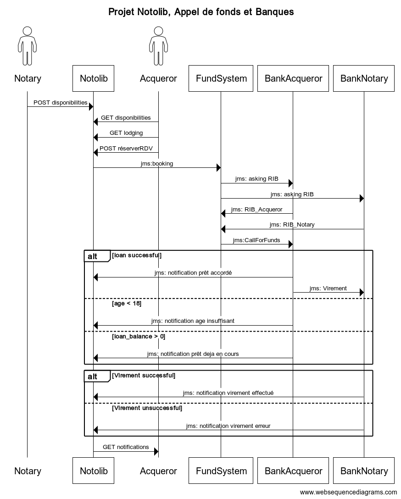

## Objectifs du système à modéliser
On se propose de modéliser un système de prise de rendez-vous (Notolib) entre des acquéreurs (Acquirer) et des notaires (Notary) afin de créer un appel de fond concernant le logement choisi. Le système Notolib gère ainsi les disponibilitées des notaires et la prise de RDV par l’acquéreur.

Notre système est composé de 3 services :
- Notolib : Service de rendez-vous entre Notaire et Acquéreur
- Fund_system : Système permettant la création de l'appel de fond
- Bank-transfer : Modélisation des banques respectives de l'acquéreur et du notaire


## SYSTÈME 1 : Notolib

On se propose de modéliser un système de prise de rendez-vous (Notolib) entre des acquéreurs (Acquirer) et des notaires (Notary) afin de créer un appel de fond concernant le logement choisi. Le système Notolib gère ainsi les disponibilités des notaires et la prise de RDV par l’acquéreur.

Notolib propose à l’acquéreur de choisir une date pour avoir les disponibilités des notaires. Une fois la date choisie, Notolib lui propose donc les notaires disponibles ainsi que leurs créneaux de disponibilités. L’acquéreur sélectionne le créneau d’un notaire donné. Le créneau horaire devient alors indisponible pour la date du RDV. Enfin, l’acquéreur peut alors choisir un logement parmi ceux proposés afin de finaliser ce rendez-vous. Le rendez-vous ne requiert pas de validation de la part du notaire, il est automatiquement pris en compte et les deux acteurs reçoivent une notification récapitulant les informations du rendez-vous.

Exigences de la prise de rendez-vous Notolib :

* L'acquéreur DOIT pouvoir rechercher des notaires par date
*Le système DOIT proposer uniquement les horaires disponibles des notaires
*Un acquéreur DOIT choisir un horaire de RDV proposé par le système
*Le système DOIT informer l’acquéreur et le notaire de la prise de rendez-vous
*Le système DOIT informer l’acquéreur du montant du prêt accordé
*Le système DOIT informer l’acquéreur s’il a un prêt en cours de remboursement   
*Le système DOIT informer le notaire du montant du virement reçu
*Le système DOIT informer le notaire des éventuelles erreurs lors de l’étape du virement


## Interfaces

```
artist->master: POST venue
vendor->master: GET Gigs
master->vendor: Collection<Gigs>

Customer->vendor: cli:gig selection

vendor->master: jms:booking
alt booking successfull
    master->vendor: transitional tickets
    vendor->Customer: ticket purshase ok
    Customer->vendor: cli:customer informations
    
    vendor->master: jms:ticketing
    master->vendor: tickets

else booking unsuccessfull
    master->vendor: no quota for gigs
end

opt venue cancellation
    artist->master: DELETE venue
    master->vendor: jms:topic:cancellation
    vendor->Customer: smtp:cancellation email
end
```


## Schéma relationnel


## Exigences fonctionnelles

* le vendor NE DOIT proposer que les concerts pour lesquels il a un quota disponible, transmis par le master.
* le vendor DOIT pouvoir effectuer les opérations de booking et ticketing
* le master DOIT permettre à l'artiste d'annuler son concert.
* le master DOIT informer le vendor en cas d'annulation de concert
* le vendor DOIT informer les clients de l'annulation du concert par mail
* le master DOIT proposer un service de validation de la clé du ticket, pour les contrôles aux entées.

## Exigences non fonctionnelles

* le booking et le ticketing, bien qu'étant des opérations synchrones, DOIVENT être fiables et donc utiliser le messaging
* Lors de l'annulation de tickets, le master DOIT informer tous les vendors de l'annulation, de façon fiable.